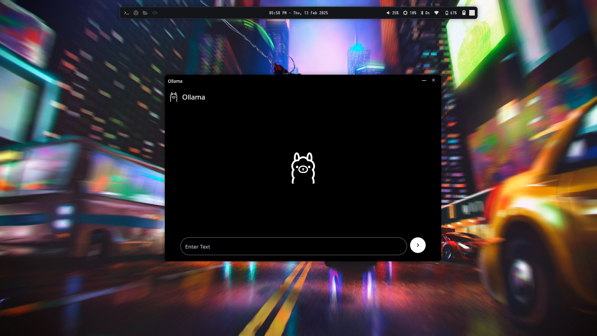
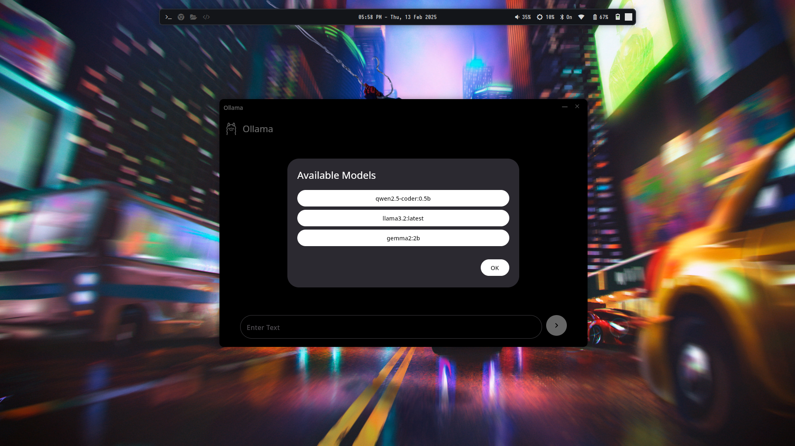
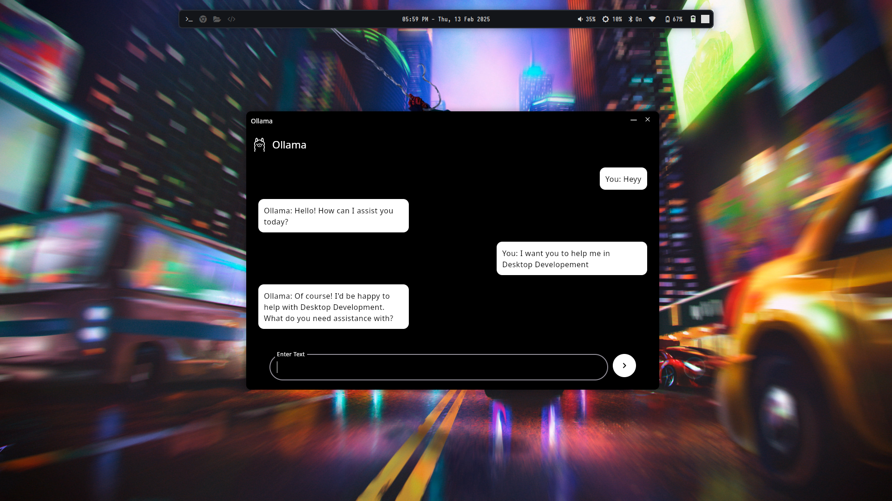

# Ollama Desktop Client

A minimal and efficient desktop client for running the Ollama AI models on your machine. Built using Compose for Desktop, this application provides a smooth and intuitive experience for interacting with AI models.

## Features

- **Lightweight & Fast**: Optimized for performance with a minimal UI.
- **Cross-Platform**: Supports Windows, macOS, and Linux.
- **User-Friendly Interface**: Simple yet powerful design for easy interaction.

## Screenshots

Here are some screenshots of the application in action:

### Home Screen

### Chat Interface

### Settings

## Installation

1. **Download** the latest release from [GitHub Releases](#).
2. **Launch the application** and start using Ollama AI on your desktop.

## Requirements

- Java 21+ (Recommended: OpenJDK 21)
- Ollama AI installed and configured
- Windows, macOS, or Linux

## Usage

1. Open the application.
2. Connect to your Ollama AI instance.
3. Start interacting with AI models.

## Contributing

We welcome contributions! Feel free to fork the repository and submit pull requests.

## License

This project is licensed under the MIT License.

---

Developed with ❤️ using Jetpack Compose for Desktop.

